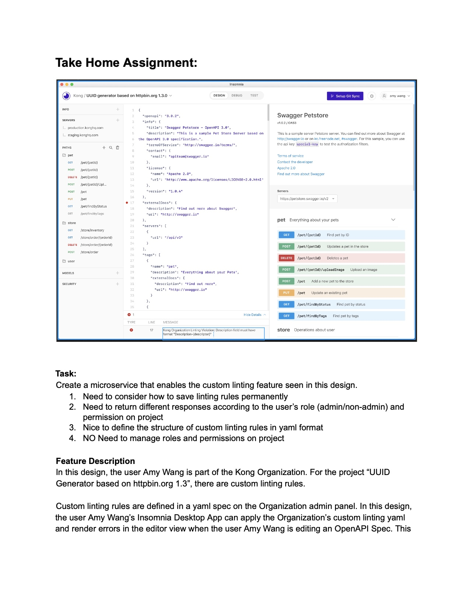
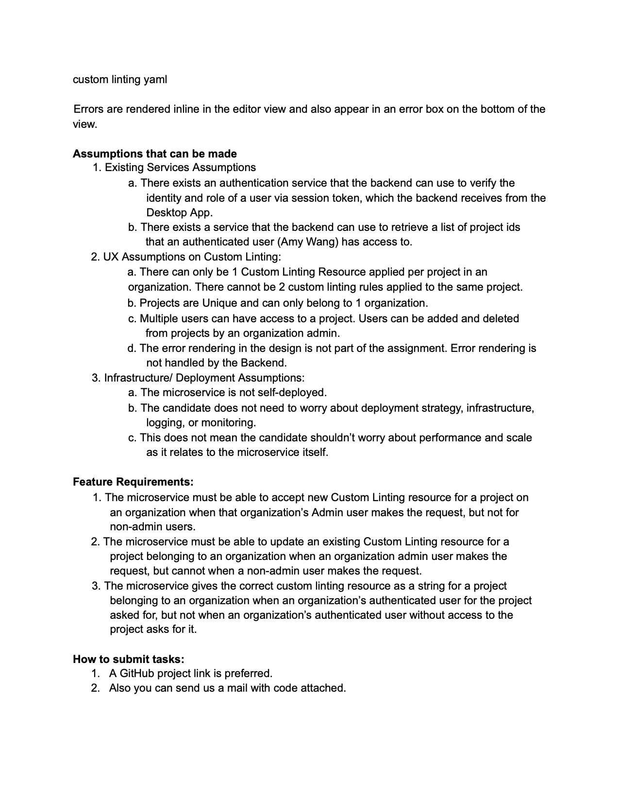
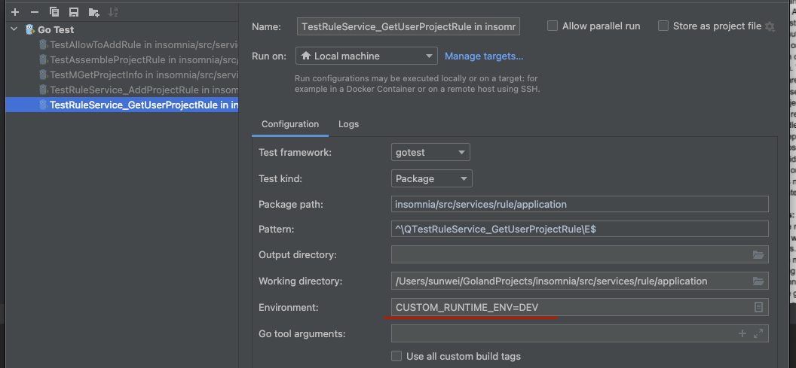

# Home Assignment of Insomnia

## Assignment Description




In summary, need to realize the following functions:

* Organization admin can create/update linting rule for a project
* Organization members can get project linting rules

## Project Structure
```
insomnia/src/pkg
.
├── app
│   └── server.go
├── config
│   ├── config.go
│   ├── impl
│   │   └── config.go
│   ├── middleware
│   │   └── initial.go
│   ├── mysql.go
│   ├── redis.go
│   └── test.go
├── log
│   └── logger.go
├── middleware_custom
│   ├── grpc
│   │   ├── err.go
│   │   └── interceptor.go
│   ├── mysql
│   │   └── options.go
│   └── redis
│       └── lock.go
└── utils
    ├── error.go
    ├── random.go
    ├── util.go
    └── util_test.go
```
As seen from the above structure, in directory pkg, there are some common packages, such as config, log, middleware_custom, utils, etc. 
* config: read component config from config file, such as mysql, redis, etc. And initialize the component for service.
* middleware_custom: custom some function of middleware, such as grpc, mysql, redis, etc.
* utils: realize common functions, such as error, random, etc.

```
insomnia/src/service
.
├── rule
│   ├── Makefile
│   ├── app.yaml
│   ├── application
│   ├── bin
│   │   └── server
│   ├── cmds
│   │   └── service
│   │       ├── build.sh
│   │       └── server.go
│   ├── config
│   │   ├── dev.yaml
│   │   └── pro.yaml
│   ├── domain
│   │   └── rule
│   │       ├── entity.go
│   │       ├── init.go
│   │       ├── repo.go
│   │       ├── repo_test.go
│   │       ├── service.go
│   │       └── service_test.go
│   ├── error
│   │   └── error.go
│   ├── handler
│   │   └── rule.go
│   ├── proto
│   │   ├── rule
│   │   │   └── rule.pb.go
│   │   └── rule.proto
│   ├── resource.go
│   ├── rule.sql
│   └── thirdparty

```
In directory service, there are microservices, which are deployed independently, such as rule, etc.
* handler: as the interface of grpc service, do some easy param check.
* application: realize the business logic of service.
* config: component config, such as mysql, redis, etc. Support different environment, such as dev, pro, etc.
* domain: offer operation on mysql, redis.
* error: custom the error of business.
* proto: grpc proto file.
* thirdparty: other service.

## Technical Component

* grpc: custom interceptor, expand grpc code, enable grpc reflection
* mysql: realize mysql options, such as select using master, select with for update, etc
* redis: using as distributed lock, avoid concurrent operation

## Deployment

You can deploy server on your local machine or use docker.

### On Local Machine
```
cd insomnia/src/services/rule/cmds/services
. build.sh
```

### In Docker
First, you need to build the docker image, and then run the docker container.
```
cd insomnia
. scripts/docker/build.sh rule insomnia:{tag_name}
docker run -p 8080:50051 insomnia:{tag_name} 
```
### Note:
* You should start mysql, redis server on your local machine.
* Different deployment methods using different server config, you can modify the config in directory insomnia/src/services/rule/cmds/services/config.


## Unittest
If you want to run unittest case, you need to export environment variables firstly, and then run unittest.
CUSTOM_RUNTIME_ENV decides the config file the server use, in includes mysql, redis configuration.
```
export CUSTOM_RUNTIME_ENV=DEV
```
Or, you can use goland test template, like the picture below.


## Api Test
Deploy in docker, use grpcurl command to test api.
### Start service

Step1:
```
. scripts/docker/build.sh rule insomnia-rule:20230424
```
Step2:
```
docker run -p 8080:50051 insomnia-rule:20230424
```
Step3:
```
docker ps
```
output:
```
CONTAINER ID   IMAGE                    COMMAND                  CREATED          STATUS          PORTS                               NAMES
a10358c4dd1d   insomnia-rule:20230424   "/bin/sh -c '/root/$…"   2 minutes ago    Up 2 minutes    8080/tcp, 0.0.0.0:8080->50051/tcp   heuristic_hamilton
```
Check the grpc reflection
```
grpcurl -plaintext localhost:8080 list
```
output:
```     
grpc.reflection.v1alpha.ServerReflection
insomnia.rule.Rule
```
At this point, the grpc service has been successfully started and the reflection has been enabled.
### Grpcurl Test
#### Bind rule with project.

CASE 1: user not organization admin and return custom grpc error code
```
grpcurl -d '{"user_id": 12345678, "organization_id": 110101, "project_id":14, "rule": "{\"age\": 30, \"country\": \"china\"}", "rule_category":1}' -plaintext 127.0.0.1:8080  insomnia.rule.RuleService.AddProjectRule
```
OUTPUT:
```
ERROR:
  Code: Code(10002)
  Message: permission forbidden
```

CASE 2: user is organization admin
```
grpcurl -d '{"user_id": 1010, "organization_id": 101, "project_id":14, "rule": "{\"age\": 30, \"country\": \"china\"}", "rule_category":1}' -plaintext 127.0.0.1:8080  insomnia.rule.RuleService.AddProjectRule
```
OUTPUT:
```
{

}
```
Check mysql table, find a linting rule record created and the project bound with the rule.

#### Update project rule
```
grpcurl -d '{"user_id": 1010, "organization_id": 101, "project_id":14, "rule": "{\"age\": 35, \"country\": \"china\"}", "rule_category":1}' -plaintext 127.0.0.1:8080  insomnia.rule.RuleService.UpdateProjectRule
```
OUTPUT:
```
{

}
```
Check mysql table, find a new rule created and the project bound with the new rule.

#### Get user project rule
```
grpcurl -d '{"user_id": 1010, "organization_id": 101, "project_id":14, "rule_category":1}' -plaintext
```
OUTPUT:
```
{
  "projectRules": [
    {
      "organId": 101,
      "projectId": 14,
      "rule": "{\"age\": 35, \"country\": \"china\"}",
      "ruleCategory": 1,
      "projectName": "insomnia"
    }
  ]
}
```
